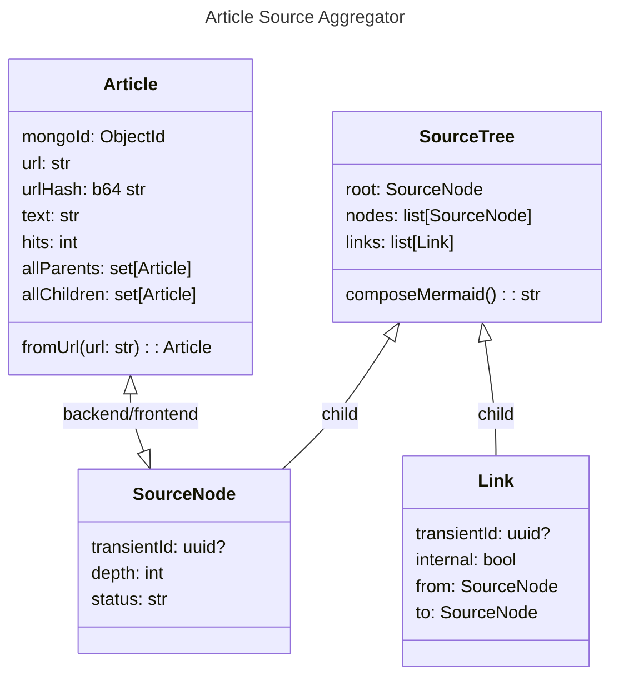
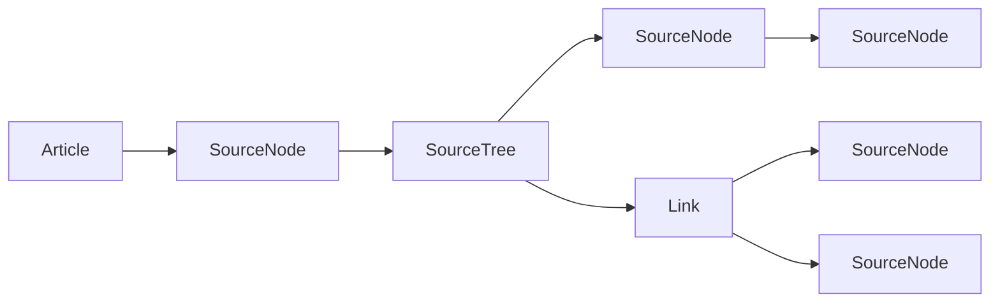

# article-source-aggregator

Build a source tree from a news article recursively

```
source setup.sh
python3 -m articlesa.front.article
```


## Data Structures



## Displaying the tree

SourceNodes are nodes on a graph. Links are edges on a graph.

SourceTree goes left to right, depth levels are TB subgraphs.



### URLs to test

```
https://www.thegatewaypundit.com/2019/11/revealed-adam-schiff-connected-to-both-companies-named-in-7-4-billion-burisma-us-ukraine-corruption-case/
```
